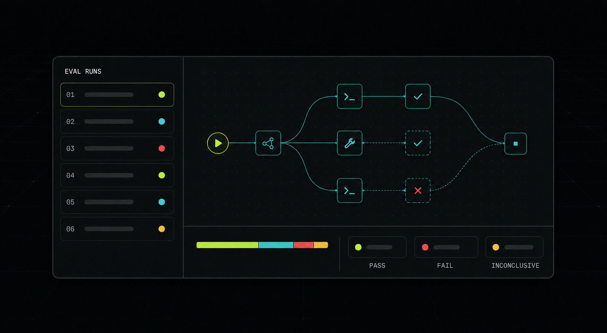

# Featherlane AI

> Open-source evals for AI agents that act.



Featherlane runs complete agent workflows against human-approved policies. Turn
rules and real failures into repeatable evals, inspect model and tool traces,
and get `PASS`, `FAIL`, or `INCONCLUSIVE` with the evidence behind each result.

## What you get

- End-to-end HTTP and webhook agent evals
- Trace, tool-action, and side-effect evaluation
- Deterministic policy checks that run in CI
- JSON, JUnit, HTML, API, and web-console results

## Quick start

```bash
git clone https://github.com/ducnguyen67201/Featherlane-AI.git
cd Featherlane-AI
docker compose up --build
```

Open [http://localhost:3000](http://localhost:3000).

Featherlane provides scope-limited evaluation evidence—not legal compliance
certification. The project is a working, pre-pilot MVP.

[Architecture](docs/architecture.md) · [Integration](docs/integration.md) ·
[Security](docs/security.md)

Built with Rust, PostgreSQL, Next.js, and OpenTelemetry. Licensed under
[Apache 2.0](LICENSE).
