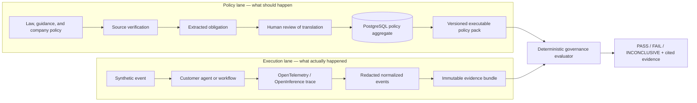

# Architecture

Featherlane separates what should happen from what actually happened.

## Why Loco

Loco supplies startup conventions, environment configuration, Axum route
composition, SeaORM migrations, and PostgreSQL-backed workers. These are useful
application-shell concerns. The domain, policy compiler, target contracts,
normalizer, evaluator, and report renderer do not import Loco, which preserves a
fast unit-test loop and allows future embedding in other Rust deployments.

## Data ownership

All persisted records carry an organization identifier. ORM models stay inside
`governance-persistence`; domain types cross the application boundary. Published
policy versions and finalized evidence bundles are treated as immutable.

Policy persistence is aggregate-based and transactional:

- `policy_packs` stores immutable version metadata and publication state;
- `policy_rules` stores every compiled rule as a versioned row;
- `sources` and `obligations` store provenance and extracted requirements;
- `policy_pack_sources` preserves the exact source set used by a pack;
- `policy_reviews` stores human publication decisions.

The API imports schema-validated JSON into a draft. Approval is only possible
after every linked obligation has a persisted human review. Both active and
passive evaluation load rules by policy-pack ID from PostgreSQL. No executable
policy is loaded from a repository file, environment variable, worker payload,
or frontend fallback.

## Evaluation semantics

- deterministic assertions run first and cite concrete event identifiers;
- missing blocking evidence never becomes a pass;
- high/critical deterministic failures produce `FAIL`;
- absent or insufficient evidence produces `INCONCLUSIVE` unless a rule's
  explicit missing-evidence policy says otherwise;
- semantic judges are a later calibrated layer and cannot silently override a
  deterministic critical failure.
