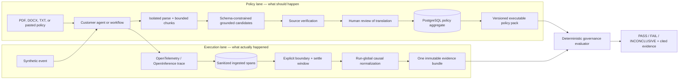

# Architecture

Featherlane separates what should happen from what actually happened.

## Why Loco

Loco supplies startup conventions, environment configuration, Axum route
composition, SeaORM migrations, and PostgreSQL-backed workers. These are useful
application-shell concerns. The domain, policy compiler, target contracts,
normalizer, evaluator, and report renderer do not import Loco, which preserves a
fast unit-test loop and allows future embedding in other Rust deployments.

## Data ownership

All persisted records carry an organization identifier. ORM models stay inside
`governance-persistence`; domain types cross the application boundary. Published
policy versions and finalized evidence bundles are treated as immutable.

An `EvaluationRun` is the business boundary and the only evaluation key. One run
means one workflow execution, agent task, voice call, or explicit CI execution.
It may include many invocations, trace IDs, batches, retries, and linked spans.
Its lifecycle is `created → collecting → settling → finalizing → evaluating →
completed`; cancellation and operational failure are separate terminal states
and are never displayed as a policy `FAIL`.

OTLP receipt only stores bounded, redacted spans. Completion starts a short
settle window; the durable worker then reloads every span for the run, computes a
causal order using parents and links, assigns deterministic event IDs and global
sequence numbers, and writes one immutable bundle. Evaluation loads the policy
ID/version/hash pinned when the run was created. Neither an OTLP request nor one
trace fragment can produce a verdict.

Policy persistence is aggregate-based and transactional:

- `policy_imports` stores tenant-scoped state, hashes, parser/model provenance,
  extraction coverage, failures, and object keys;
- `policy_candidates` stores exact excerpts, locators, normalized statements,
  rule suggestions, confidence, mapping state, and the current disposition;
- `policy_candidate_reviews` is the append-only before/after decision trail;
- `policy_packs` stores immutable version metadata and publication state;
- `policy_rules` stores every compiled rule as a versioned row;
- `sources` and `obligations` store provenance and extracted requirements;
- `policy_pack_sources` preserves the exact source set used by a pack;
- `policy_reviews` stores human publication decisions.

The source workflow writes the raw artifact first, queues an ID-only job, then
uses compare-and-set state transitions (`queued → parsing → extracting →
review_required`). Workers re-read the tenant-scoped record and verify the
artifact SHA-256 before parsing. A pack can be compiled only when extraction
coverage is complete, source provenance is verified, every candidate is
disposed, at least one candidate is approved, and all approved mappings are
supported deterministic rules. Both active and passive evaluation load rules by
policy-pack ID from PostgreSQL. No executable policy is loaded from a repository
file, environment variable, worker payload, or frontend fallback.

The current worker parses embedded text only. Scanned PDFs transition to
`needs_ocr`; OCR is intentionally not performed silently because its output must
be retained and reviewed as a distinct evidence transformation.

## Evaluation semantics

- deterministic assertions run first and cite concrete event identifiers;
- missing blocking evidence never becomes a pass;
- high/critical deterministic failures produce `FAIL`;
- absent or insufficient evidence produces `INCONCLUSIVE` unless a rule's
  explicit missing-evidence policy says otherwise;
- semantic judges are a later calibrated layer and cannot silently override a
  deterministic critical failure.
